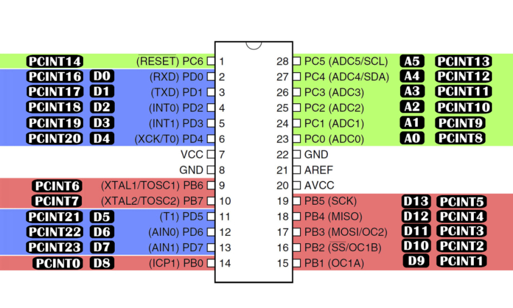

# Voltímetro com Arduino

Este projeto implementa um voltímetro simples utilizando o **Arduino Uno (ATmega328P)**. A leitura da tensão é feita através das entradas analógicas do microcontrolador e exibida em um monitor serial.  

---

## 🧾 Descrição do Projeto

- O Arduino mede tensões aplicadas em suas portas **analógicas (A0 – A5)**.  
- Cada porta está conectada ao **Conversor Analógico-Digital (ADC)** de 10 bits do ATmega328P.  
- O valor lido (0–1023) é convertido em uma tensão real com base na referência de 5V (padrão) ou outra definida no código.  
- Esse projeto demonstra como acessar os registradores internos do ADC para maior controle, ao invés de depender apenas das funções da IDE (`analogRead()`).

---

## ⚙️ Funcionamento do ADC

O **ADC (Analog to Digital Converter)** do ATmega328P converte sinais analógicos em valores digitais de 10 bits.  

### Principais Registradores:

1. **ADMUX (ADC Multiplexer Selection Register)**  
   - Seleciona a entrada analógica (A0–A5).  
   - Define a referência de tensão (por exemplo, AVcc = 5V).  
   - Bits principais:  
     - `REFS1:0` → Seleção da referência.  
     - `MUX3:0` → Seleção do canal ADC.  

2. **ADCSRA (ADC Control and Status Register A)**  
   - Liga/desliga o ADC.  
   - Inicia conversões.  
   - Controla prescaler (divisor de clock do ADC).  
   - Bits principais:  
     - `ADEN` → Habilita o ADC.  
     - `ADSC` → Inicia conversão.  
     - `ADPS2:0` → Define o prescaler.  

3. **ADCL e ADCH (ADC Data Registers)**  
   - Guardam o resultado da conversão (10 bits).  
   - `ADCL` → 8 bits menos significativos.  
   - `ADCH` → 2 bits mais significativos.  

---

## 🔌 Conexões

- **Entrada de tensão** → Pino **A0** (pode ser ajustado para A1–A5 via registradores).  
- **GND** do circuito de entrada → **GND** do Arduino.  
- Se a tensão a ser medida for maior que 5V, **use um divisor resistivo** para não danificar o microcontrolador.  

---

